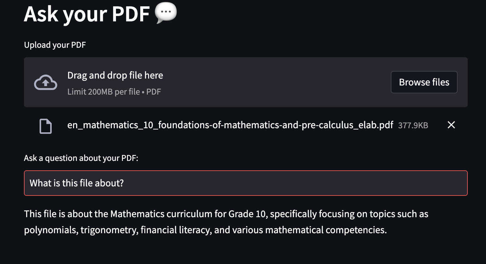

# CCTB Hackathon Prototype, April 2024
---


## Table of content

- [Theme of The Hackathon](#theme-of-the-hackathon)
- [Before You Start Coding](#before-you-start-coding)
  - [Obtain an OpenAI API Key from the Hackathon Organizers](#obtain-an-openai-api-key-from-the-hackathon-organizers)
  - [Know each other's strength](#know-each-others-strength)
- [Get Started](#get-started)
  - [The Prototype Overview](#the-prototype-overview)
  - [Installation](#installation)
  - [Start the Application](#start-the-application)
- [Walkthrough of Code](#walkthrough-of-code)
  - [app.py file](#apppy-file)
  - [llm.py file](#llmpy-file)
- [Ideal Team Structure](#ideal-team-structure)
- [FAQ](#faq)
- [Potential Ideas and Directions](#potential-ideas-and-directions)
  - [Choose a Domain of Application](#choose-a-domain-of-application)
  - [Technical Improvements](#technical-improvements)
- [Credits](#credit)

## Theme of The Hackathon

Large language models (LLM) are a type of artificial intelligence that can generate human-like text. They have been used to generate text, answer questions, and even write code. 

For example, ChatGPT is one of the most popular LLMs. It is based on the GPT-3 model, which was developed by OpenAI. ChatGPT has been used to create chatbots, answer questions, and generate text. It has been used in a wide range of applications, including customer service, education, and entertainment.

<p align="center">
  
</p>


Meanwhile, building an LLM application is becoming more and more accessible. The goal of this hackathon is to build a prototype of an LLM application that can be used to solve a real-world problem. The modern tools like Langchain, Huggingface, and OpenAI are very helpful to build such an application.On another hand, libraries like Streamlit can be used to create a user-friendly interface for the application, which significantly reduces the idea-to-prototype time.


## Before You Start Coding

### Obtain an OpenAI API Key from the Hackathon Organizers

When you start working this prototype, one of your teammate should reach out to the hackathon organizers to get the OpenAI API key. This key is required to use the OpenAI GPT models. Each team will only get one key and the key is valid for the duration of the hackathon.

### Know each other's strength

Before you start coding, it is important to know each other's strength. For example, if you have a teammate who is good at front-end development, you can assign them to work on the user interface. If you have a teammate who is good at natural language processing, you can assign them to work on the prompt engineering. Knowing each other's strength will help you to work more efficiently and produce a better prototype.

## Get Started

### The Prototype Overview

The prototype is a simple application that reads the PDF and splits the text into smaller chunks that can be then fed into a LLM. It uses OpenAI embeddings to create vector representations of the chunks. The application then finds the chunks that are semantically similar to the question that the user asked and feeds those chunks to the LLM to generate a response.

The application uses Streamlit to create the GUI and Langchain to deal with the LLM.


### Installation

To install the repository, please clone this repository and install the requirements:

#### Create a virtual environment (optional)

This step is optional but it is highly encouraged. If you are not using other virtual environment management tools. Feel free to use them too. 

Suppose you use the built-in Python virtual environment management module, let's call this virtual env `hack`

```
python3 -m venv hack

```

After creating the virtual environment, activate it:

```
source hack/bin/activate
```
If you want to deactivate the virtual environment, you can run:

```
deactivate
```
Then install the requirements:

```
pip3 install -r requirements.txt
```

You will also need to add the OpenAI API key to the `.env` file. If the file doesn't exist, create it. It should look like this:

```
OPENAI_API_KEY="your_api_key"
```

### Start the Application

To use the application, run the `main.py` file with the streamlit CLI (after having installed streamlit): 

```
streamlit run app.py
```

After a few seconds, a new tab will open in your default browser with the application running. You can then use the application to ask questions and get answers.


There are some PDF files in the `pdfs` directory that you can use to test the application. You can also upload your own PDF files to test the application.

For example, if I upload the BC's math [curriculum](./pdfs/en_mathematics_10_foundations-of-mathematics-and-pre-calculus_elab.pdf) for grade 10 PDF and ask what is this file about.



And in the terminal, you can see that how much does it cost to generate the answer.


> Please refrain from using more expensive model like GPT-4 (set in llm.py) before you validate your prototype. The cost of using the expensive models can be very high and it can quickly consume your credit.

1. The PDF must be typed. Scanned PDFs are in general not supported.
2. PDFs must have a clean structure. If the PDF has a lot of images, tables, or other non-text elements, the application may not work as expected.


## Walkthrough of Code

Now let's walk through the code. You may be suprised that the code is very simple.

There are two main files: the [app.py](./app.py) and the [llm.py](./tool/llm.py) file. 

The `app.py` file contains the Streamlit application. It is a simple application that allows the user to upload a PDF file and ask questions about the content of the PDF file. The application then uses the `llm.py` file to find the answer to the question.


### app.py file

Let's look at the `app.py` file first.

The `get_openai_key` function and the `get_pdf_text` function are used to get the OpenAI API key and the text from the PDF file, respectively. The `get_openai_key` function reads the OpenAI API key from the `.env` file and the `get_pdf_text` function uses the `PyPDF2` library to read the text from the PDF file.

The `st_first` function is the function that initializes the application's UI. It creates the user interface using the Streamlit library. Yes, only 2 lines and you have a user interface. `st` stands for `streamlit`. The `st.set_page_config` function is used to set the title of the application and the `st.header` function is used to create a header in the application.

The best thing about Streamlit is that you can create a user interface elements interleaved with the Python code. For example, the `st.file_uploader` function in the `main` function is used to create a file uploader in the application. The `st.text_input` function, also in the `main` function is used to create a text input area in the application to read from the user.

The second best thing about Streamlit is that it is automatically `reactive`. You can just program the UI elements as normal Python variables and any variable's change will automatically update the UI. You can run the [st_example.py](./examples/st_example.py) file and see how the UI elements are updated automatically if you change anything on the side bar.

> It is advised to assign one of your team member to work on the streamlit UI elements and the other to work on the backend. This way, you can work in parallel and save time. There are tons of streamlit examples on the internet. A good start place to look for inspirations is the [streamlit gallery](https://streamlit.io/gallery).

Let's continue with the `app.py` file. 

From line 47 to line 51, we split the text into smaller chunks and created an `embedding` object using `OpenAIEmbeddings` class. An embedding is essentially a vector representation of the text. We then find the chunks that are semantically similar to the question that the user asked and feed those chunks to the LLM to generate a response.

FAISS is short for Facebook AI Similarity Search. It is a (vectorstore) module in Langchain that is used to find the most similar chunks to the question that the user asked. We apply the `embeddings` to the chunks and created a vector representation of the chunks. It is then stored in a variable called `knowledge_base`.

> For more information about FAISS, you can check the [FAISS documentation](https://python.langchain.com/docs/integrations/vectorstores/faiss). Also FAISS is not the only vector store you can use. You can find other vector stores in the Langchain [documentation](https://python.langchain.com/docs/integrations/vectorstores).

Line 53 asks for user's question and stores it in a variable called `user_question`.

Line 55 is a direct similarity search between the user's input and the knowledge_base. The `docs` variable is not used in the application because we are going to use the llm engine to generate a better answer (and pay for that!). However, you may use the `docs` variable in your own application. To see how to use the `docs` variable,  check out the [query](https://python.langchain.com/docs/integrations/vectorstores/faiss#querying) section on the documentation page.

Now let's explore line 56 to line 60. We are stepping into the `llm.py` file.

### llm.py file

The `llm.py` file contains only one class `LlmEngine`. 

Its `__init__` method defines which model to use. You can find available models in the [OpenAI documentation](https://platform.openai.com/docs/models). Ideally this is the only place you need to change the `__init__` method.

There are two methods left: `get_qa_chain` and `get_history_chain`. The biggest difference is that at the return line, one uses `RetrievalQA` and another uses `ConversationalRetrievalChain`.  These two methods are the gateway to the OpenAI API.

Both methods create a `prompt_template` variable. This is where prompt engineering happens. The current prompt is very simple. As you may know that with proper prompt crafting, LLM can generate very different and very interesting results.

> One of your team members will spend quite sometime on prompt engineering. It is a very important part of the application. The prompt engineering can be very creative and it can be very challenging. You can find some examples of prompt engineering in the [OpenAI documentation](https://platform.openai.com/docs/guides/prompt-engineering).

The difference between `get_qa_chain` and `get_history_chain` is that the `get_qa_chain` method only asks one question and gets one answer. The `get_history_chain` method need to take the history of the chats, as a list, as an input. If you use the `get_history_chain` method, you need to keep track of the history of the chats and pass it to the `chain()` call at line 58.

The [history_example](./examples/history_example.py) file is a good example of how to use the `get_history_chain` method. It also includes some new content about using streamlit and vector store. 


1. It shows how to save and load the vectorstore locally
2. It uses `streamlit_chat` to simulate a chat window
3. It demonstrates how to read from a non-PDF file. In this case, a CSV file.
4. It utilizes the streamlit session state to keep track of the history of the chats.

> If you are aiming to build a chatbot, definitely study the [history_example](./examples/history_example.py) file. 

Now back to the `app.py` file.

### app.py file (continued)

Line 57 of `get_openai_callback` is a context manager that allows you to print out the response from the API endpoint, so you can monitor the response from the OpenAI API: how many tokens are used, how much does it cost, and what is wrong if the response is not as expected.

Line 60 writes the actual response to the UI

## Ideal Team Structure

Ideally your team should contain at least 3 members.

1. The Front End Guy
2. The LLM Guy
3. The Product Guy

The Front End Guy is responsible for creating the user interface using Streamlit. The LLM Guy is responsible for creating the LLM engine using Langchain. The Product Guy is responsible for coming up with the idea and the use case of the application. The Product Guy is also responsible for searching for valid resources to test and demo the application.


## FAQ

Q1: What's a `chain`? 

Great question! In plain words, a chain is a sequence of interconnected components designed to execute tasks in a specific order. There are many many chains in Langchain. For details, please vist the [Langchain Chain Documentation](https://python.langchain.com/docs/modules/chains/).

> It is strongly advised *not* to go too deep into this rabbit hole. Focus on the task at hand and only learn what you need to know.

Q2: How do `RetrievalQA` and `ConversationalRetrievalChain` work? If we have llm, why do llm and vector store work together?

For RetrievalQA,

> The RetrievalQA chain first does a retrieval (from `knowledge_base`) step to fetch relevant documents, then passes those documents into an LLM to generate a respoinse. Here the documents mean the splitted chunks that stored in the `knowledge_base`.

For ConversationalRetrievalChain,

> The ConversationalRetrievalChain chain can be used to have conversations with a document. It takes in a question and (optional) previous conversation history. If there is previous conversation history, it uses an LLM to rewrite the conversation into a query to send to a retriever (otherwise it just uses the newest user input). It then fetches those documents and passes them (along with the conversation) to an LLM to respond.

Q3: Can I tune the FAISS parameters?

> Yes. You can try other vector stores too.


## Potential Ideas and directions

Note that there are literally infinitely many ways to build on top of the prototype. However, you should always start with a simple idea and then iterate on it. Here are some potential ideas and directions:

### Choose A Domain of Application

1. Read tax files and immigration law documents to build an AI assistant.
2. Read from real-time APIs to generate weather or traffic or news information.
3. Built a personal assistant that can schedule meetings automatically by reading emails to handle time conflicts.
4. Many many others 

### Technical Improvements

1. The vectorstore can be pre-built so it contains much more information than a single file.
2. The prompt engineering can be much more sophisticated.
3. The UI can be improved significantly.
4. Fine-tune the API calls and the text splitter.
5. Many many others.

## Credit

The prototype was based on an early version of this [project](https://github.com/wsy258-strar/DocGPT). It is then customized for learning purposes.

The [history_example](./examples/history_example.py) file is modified based on this medium [post](https://medium.com/@anoopjohny2000/building-a-conversational-chat-interface-with-streamlit-and-langchain-for-csvs-8c150b1f982d).

Thanks go to the authors for their great work.